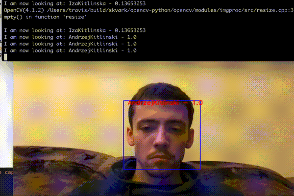

## Face Identifier App

Application for student face identification

### Steps:

#### Data collecting and maintance:

- Collect face data by running `main_data_collector.py`
- `cd utils`
- Use `python file_renamer.py` & `python id_assigner.py` to prepare data before splitting it
- Use `python raw_data_splitter.py` to split data into train and test folders

#### Learning faces from extracted data:

- `cd ../` & `python main_train.py`
- To verify training results `python main_test.py` that simply evaluate model

#### Identifying students:

- To start identifying students from local camera run `main_identify.py`

### Examples:

First try with model trained on 8 people X 100photos per person

